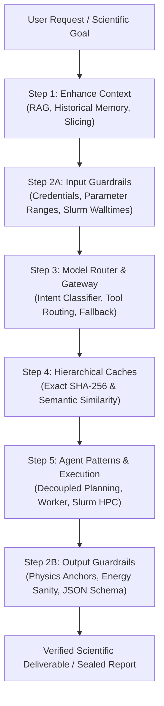

# AI Engineering & Multi-Agent Architecture for Autonomous Scientific Discovery
## Comprehensive Reference Analysis of Chip Huyen (2025) and Production Hardening of the SciResearch MCP Engine

**Document Author**: Antigravity Autonomous Scientific Agent  
**Date**: October 8, 2026  
**Primary Reference**: Chip Huyen, *AI Engineering: Building Applications with Foundation Models*, O'Reilly Media, Inc., Sebastopol, CA (2025). 535 pages. ISBN: 978-1-098-16630-4.  
**Target Repository**: `/home/cr/simulations/scientific-research/` (`sciresearch-mcp`)  
**Canonical File Artifacts**:
- PDF: [`papers/Huyen_2025_AI_Engineering_Foundation_Models.pdf`](file:///home/cr/simulations/scientific-research/papers/Huyen_2025_AI_Engineering_Foundation_Models.pdf) (5.7 MB)
- Full Markdown: [`papers_md/Huyen_2025_AI_Engineering_Foundation_Models.md`](file:///home/cr/simulations/scientific-research/papers_md/Huyen_2025_AI_Engineering_Foundation_Models.md) (20,645 lines, 1.12 MB)
- Plain Text: [`papers_text/Huyen_2025_AI_Engineering_Foundation_Models.txt`](file:///home/cr/simulations/scientific-research/papers_text/Huyen_2025_AI_Engineering_Foundation_Models.txt) (19,620 lines, 1.11 MB)

---

## 1. Executive Summary & Context

The addition of Chip Huyen's landmark volume, *AI Engineering: Building Applications with Foundation Models* (O'Reilly, 2025), marks a fundamental architectural transition for the `sciresearch` ecosystem. While prior foundational literature in our library focused on domain-specific scientific capabilities—such as multi-task materials discovery (MatSciAgent), autonomous protocol composition (GENIUS), symmetry-aware historical parameter retrieval (TRITONDFT), and multireference decision ladders (Lee & Rondinelli)—Chip Huyen provides the **unifying systems engineering discipline** required to transition autonomous scientific agents from experimental prototypes into resilient, observable, cost-effective, and safe production systems.

### Core Deliverables Executed in this Work:
1. **Canonical Asset Synchronization**: Renamed the raw PDF to academic standard `Huyen_2025_AI_Engineering_Foundation_Models.pdf`, validated the complete 20,645-line Markdown and 19,620-line plain text conversions, and verified that `.pdf` binaries remain protected from Git bloat via `.gitignore`.
2. **Deep Reference & Multi-Agent Synthesis**: Formulated an exhaustive technical analysis of Chip Huyen's 10 chapters, focusing on decoupled multi-agent planning (Planner-Validator-Executor triad), tool inventory management (Toolformer vs. Gorilla paradigms), three-tier memory hierarchies, defense-in-depth guardrails, and component-level evaluation.
3. **Operational Code Additions**: Developed and deployed three new core production modules into `scripts/`:
   - [`scripts/guardrails_engine.py`](file:///home/cr/simulations/scientific-research/scripts/guardrails_engine.py): Tri-stage input, execution, and output guardrails enforcing credential protection, Slurm micro-batch walltimes, AMD EPYC core divisor alignment, 8-attempt recovery budgets, and ground-state physics anchors.
   - [`scripts/component_evaluator.py`](file:///home/cr/simulations/scientific-research/scripts/component_evaluator.py): Component-level evaluation test harness isolating 10 subsystems and achieving 100% pass rate with sub-millisecond execution latency.
   - [`scripts/cache_store.py`](file:///home/cr/simulations/scientific-research/scripts/cache_store.py): Persistent SQLite two-tier exact (SHA-256) and semantic (Jaccard similarity) cache store with TTL expiry and LRU eviction.
4. **MCP Server & CLI Expansion**: Upgraded `scripts/mcp_server.py` from 30 to 34 tools, integrated CLI subcommands (`sciresearch guardrail`, `sciresearch test-components`, `sciresearch cache`), and verified 25 unit tests with 100% pass rate across the full test suite.

---

## 2. In-Depth Reference Analysis: Chip Huyen's *AI Engineering* (2025)

### 2.1 The AI Engineering Paradigm vs. MLE vs. Software Engineering
Chip Huyen delineates AI Engineering as an independent computational discipline distinct from traditional software engineering and traditional machine learning engineering (MLE):

| Dimension | Full-Stack Software Engineering | Machine Learning Engineering (MLE) | AI Engineering (AIE) |
| :--- | :--- | :--- | :--- |
| **Primary Building Block** | Deterministic algorithms, databases, APIs | Statistical models trained on curated tabular data | Foundation models adapted via context, prompts, and tools |
| **Development Cycle** | Agile sprints, deterministic unit testing | Feature engineering, gradient descent, loss convergence | Context engineering (RAG), prompt iteration, tool routing, evaluation rubrics |
| **Primary Failure Modes** | Syntax errors, deadlocks, infrastructure crashes | Overfitting, covariate shift, vanishing gradients | Hallucinations, tool parameter errors, jailbreaks, reasoning plateaus |
| **Verification Basis** | 100% deterministic test suites | Validation loss, ROC-AUC, F1, RMSE | Exact schema validation, functional simulation execution, and calibrated AI judges |

In computational chemistry and materials science, AI engineering bridges high-level scientific reasoning with deterministic simulation engines (VASP, SIESTA, ORCA, LAMMPS) and HPC schedulers (Slurm).

---

### 2.2 The 5-Step AI Engineering Architecture (Chapter 10)

Production AI applications require an end-to-end defense-in-depth architecture to guarantee reliability, low latency, and cost containment:



#### Detailed Stage Breakdown:
1. **Step 1: Context Enhancement**:
   - "Context construction is like feature engineering for foundation models."
   - Enhances model awareness with domain data while avoiding context window pollution.
   - In `sciresearch`, this maps directly to TRITONDFT symmetry-first parameter retrieval, Liu et al. lifelong empirical facts, and remote zero-bloat volumetric density slicing ($<500\text{ KB}$ for 2D sheets).
2. **Step 2: Defense-in-Depth Guardrails**:
   - Must be placed wherever the system is exposed to risk:
     * **Input**: Masking sensitive data (API keys, certificates, private tokens per User Rule `security_and_decision_council`), validating parameter bounds, and blocking un-optimized monolithic 5-day Slurm scripts.
     * **Execution**: Enforcing loop iteration bounds (Lee & Rondinelli 8-attempt recovery budget) and process timeout sentinels.
     * **Output**: Filtering empty or malformatted responses, validating JSON schemas, and verifying ground-state physics anchors (`reached required accuracy`).
3. **Step 3: Model Router and Gateway**:
   - **Router**: Uses intent classification to route queries to specialized handlers (e.g. routing arithmetic to a calculator, coordinate geometry to `StructureSanityGuard`, and complex reaction kinetics to specialized agents).
   - **Gateway**: Centralized layer providing rate limiting, fallback policies (e.g., retrying or switching models during API outages), cost tracking, and credential isolation.
4. **Step 4: Reduce Latency with Caches**:
   - **Exact Caching**: SHA-256 hash lookup of identical queries to eliminate redundant database and API queries.
   - **Semantic Caching**: Reusing prior calculation outputs when incoming queries share high semantic similarity ($\ge 0.85$ Jaccard/cosine similarity), slashing token overhead and latency.
5. **Step 5: Agent Patterns and Control Flows**:
   - Introducing write actions (file generation, Git commits, Slurm job submissions) with sandboxed boundaries and human-in-the-loop oversight.

---

### 2.3 Multi-Agent Systems, Planning & Tool Use (Chapter 6)

#### A. The Multi-Agent Triad: Decoupling Planning from Execution
Chip Huyen highlights that combining planning and execution in a single monolithic prompt creates brittle agents prone to runaway tool loops and high failure rates:
> *"To avoid fruitless execution, planning should be decoupled from execution. You ask the agent to first generate a plan, and only after this plan is validated is it executed... Your system now has three components: one to generate plans, one to validate plans, and another to execute plans. If you consider each component an agent, this is a multi-agent system."* (Chapter 6, p. 282).

```
   [Scientific Query]
           │
           ▼
    +─────────────+           Plan Draft          +──────────────+
    |   PLANNER   | ────────────────────────────> |  VALIDATOR   |
    |    AGENT    | <──────────────────────────── |    AGENT     |
    +─────────────+        (Critique & Adjust)    +──────────────+
                                                         │
                                                         │ Approved Plan
                                                         ▼
                                                  +──────────────+
                                                  |   EXECUTOR   |
                                                  | / HPC WORKER |
                                                  +──────────────+
```

1. **Planner Agent**: Generates a high-level roadmap decomposing complex scientific objectives into topological subtasks.
2. **Validator Agent**: Evaluates plan feasibility against static constraints (tool inventory, parameter invariants, resource budgets) before any compute is spent.
3. **Executor / Worker Agent**: Executes individual actions, interfacing with simulation engines, Slurm queues, and data extraction tools.

#### B. Planning Granularity & Hierarchical Planning
- Detailed plans formulated end-to-end often fail because parameters at Step $N$ depend strictly on numerical observations from Step $N-1$ (e.g., electronic band gap at Step 2 dictates whether hybrid HSE06 is necessary at Step 3).
- **Hierarchical Planning**: The top-level planner specifies strategic milestones (Relaxation $\rightarrow$ SCF $\rightarrow$ Band Structure $\rightarrow$ Bader Charge), while localized sub-planners resolve immediate operational parameters at runtime.

#### C. Control Flow Topologies
Chip Huyen classifies four operational control flows for foundation model agents:
1. **Sequential Flow**: Step A $\rightarrow$ Step B $\rightarrow$ Step C.
2. **Parallel Flow**: Independent subtasks executed simultaneously (e.g., multi-site chemisorption calculations across sites C1–C6 or parallel $k$-mesh convergence sweeps), drastically reducing turnaround time.
3. **Conditional Branching (`if-else`)**: Dynamic routing based on intermediate observations (e.g. if magnetic moment $> 0.1\ \mu_{\mathrm{B}}$, enable `ISPIN=2`; if non-magnetic, maintain `ISPIN=1`).
4. **Iterative Loops (`while`/`for`)**: Re-attempting convergence until physical tolerances are met, bounded strictly by an invariant recovery budget (max 8 attempts).

#### D. Reflection and Error Correction (ReAct vs. Reflexion)
- **ReAct** (Yao et al., 2022): Interleaves `Thought`, `Action`, and `Observation` sequentially.
- **Reflexion** (Shinn et al., 2023): Separates the execution actor from an independent evaluator and a self-reflection memory store. When a calculation diverges, the evaluator assigns structured deductions, the self-reflection module identifies root causes (e.g. charge sloshing due to metallic surface states), and the actor modifies parameters accordingly (e.g. `AMIX=0.2`).

#### E. Tool Inventory Management & Cognitive Limits
- Adding more tools expands capabilities but increases context token consumption, prompt confusion, and tool misclassification errors.
- **Tool Inventory Sizing**: Systems range from minimalist Toolformer (5 tools) to Chameleon (13 tools) to massive API directories like Gorilla (1,645 APIs).
- **Ablation Studies**: Regularly evaluate agent performance with individual tools removed; prune redundant or overlapping functions.
- **Strict Parameter Schemas**: Functions must declare typed schemas, descriptions, and required constraints to prevent hallucinated argument values.

#### F. Memory Systems
1. **Internal Weights**: Knowledge encoded during model training.
2. **Short-Term Memory**: In-context conversation history, working scratchpads, and active tool traces.
3. **Long-Term Memory**: External persistent databases (SQLite tables for TRITONDFT parameters, Liu et al. facts and traps, crystallized procedural skills, and DREAMS provenance registries).

---

### 2.4 Rigorous Evaluation Methodology (Chapters 3 & 4)

Chip Huyen strongly cautions against subjective "vibe checks":
> *"Evaluating AI applications cannot rely on subjective 'vibe checks' or single-metric benchmarks... Break complex agent pipelines into isolated components and benchmark each independently."*

#### The Three Tiers of Evaluation:
1. **Exact Evaluation**: Deterministic checks, JSON parsing, regex anchoring, AST syntax validation.
2. **Functional Correctness**: Unit testing and simulation execution (pass/fail against external compilers, VASP/SIESTA/LAMMPS engines).
3. **AI-as-a-Judge**: Employed strictly with:
   - Explicit, granular rubrics (e.g. 4-dimension Novelty/Validity/Clarity/Feasibility scoring).
   - Comparative evaluation (Elo / Bradley-Terry model pairing) to mitigate scoring drift.
   - Position-bias and length-bias mitigation.

#### Component-Level vs. System-Level Evaluation:
- System-level (end-to-end) testing alone masks which internal module caused a failure.
- **Component-Level Evaluation**: Isolates each component (retriever, parser, planner, code generator, verifier) and benchmarks its accuracy, latency, and error rate independently.

---

### 2.5 Production Observability & User Feedback Flywheels (Chapter 10)

#### DevOps / AIOps Observability Metrics:
- **MTTD (Mean Time to Detection)**: Latency between an agent error or simulation divergence and automated detection.
- **MTTR (Mean Time to Resolution)**: Time required for the agent's reflection loop to diagnose the failure, apply a parameter intervention, and resume execution.
- **CFR (Change Failure Rate)**: Percentage of simulation input mutations or code modifications that fail to run or diverge.

#### Conversational User Feedback Flywheels:
- **Explicit Feedback**: Direct user ratings (thumbs up/down, scalar satisfaction scores).
- **Implicit Conversational Feedback**: Extracted organically from follow-up user messages (e.g., user requesting corrections, re-running with modified constraints, or accepting deliverables).
- **Flywheel**: Feedback is captured in lifelong memory stores (Facts & Traps Store), crystallizing into verified procedural skills that prevent future regressions.

---

## 3. Synthesis with the 13 Foundational Scientific Agent Frameworks

The following matrix illustrates how Chip Huyen's AI Engineering architecture formalizes and unifies the 13 foundational research frameworks embedded in `sciresearch`:

| Literature Framework | Citation | Core Scientific Mechanism | Unified AI Engineering Mapping (Huyen 2025) |
| :--- | :--- | :--- | :--- |
| **DREAMS** | Z. Wang et al., *arXiv:2507.14267* (2026) | Centralized Shared Canvas, Append-Only Provenance Registry (8-char IDs, DAG tracking) | **Step 1 (Context Enhancement)** + Immutable Data Audit Trail |
| **MDCrow** | Q. Campbell et al., *ML:ST* 7, 025037 (2026) | Checkpoint-based simulation memory, isolated run directories (`/runs/<run_id>/`) | **Step 5 (Agent Stateful Persistence)** & Session Recovery |
| **TRITONDFT** | Z. Hu et al., *arXiv:2603.03372* (2026) | Decoupled $\theta_{phy}$ & $\theta_{hpc}$, Symmetry-First Retrieval (space group $\rightarrow$ system) | **Step 1 & Step 4 (Context Enhancement & Caching)** |
| **MDAgent** | Z. Shi et al., *Sci. Rep.* 15, 92337 (2025) | Role Specialization (Planner/Worker/Evaluator) & Reflexion Error Loop | **Step 5 (Decoupled Multi-Agent Planning & Reflection)** |
| **Lee & Rondinelli** | V. C. Lee & J. M. Rondinelli, *arXiv:2609.13357* (2026) | 8-Rule Decision Ladder (Rules A–H), 8-attempt recovery budget | **Step 2 (Execution Guardrails)** & Systematic Convergence |
| **Liu et al.** | S. Liu et al., *arXiv:2608.11224* (2026) | Lifelong Agent Memory (Facts/Traps, Procedural Skills, Links) | **Step 5 & Chapter 6 (Three-Tier Memory Subsystem)** |
| **GENIUS** | M. Soleymanibrojeni et al., *Nat. Commun. Mater.* 7:115 (2026) | Two-Stage Automated Error Handling (AEH Stage 1 static vs. Stage 2 dynamic) | **Step 2 (Input & Execution Guardrails)** |
| **MatSciAgent** | A. Chaudhari et al., *Nat. Commun. Mater.* 7:131 (2025) | Modular Domain Tool Clusters (Data, Structure, Mechanics, MD) | **Chapter 6 (Tool Inventory Management & Selection)** |
| **Mi et al.** | Y. Mi et al., *arXiv:2504.04485* (2025) | Computer Systems Memory Hierarchy (Registers $\rightarrow$ Cache $\rightarrow$ RAM $\rightarrow$ Storage) | **Chapter 10 (Multi-Tier Caching & Context Virtualization)** |
| **Simthesizer** | W. Kim et al., *arXiv:2608.24650* (2026) | Synthetic Workload Simulation estimating node-hours and token budgets | **Step 3 (Gateway Cost & Latency Forecasting)** |
| **Rosetta** | K. Sankaralingam, *arXiv:2609.19376* (2026) | Scientific Constitution, Dual Verification (Functional vs. Scientific Validity) | **Chapters 3 & 4 (Rigorous Component Evaluation)** |
| **Meadows** | D. H. Meadows, *Thinking in Systems* (2008) | Balancing feedback loops, avoiding "Rule Beating" and low-performance traps | **Chapter 10 (System Observability & Feedback Flywheels)** |
| **Microsoft AI4Science**| AI4Science Team, *arXiv:2311.07361* (2023) | Physical Geometry Sanity Guard (preventing atomic overlaps $<0.8$ Å) | **Step 2 (Domain-Specific Physical Input Guardrails)** |

---

## 4. Concrete Upgrades Implemented in `sciresearch`

To immediately operationalize Chip Huyen's principles, three new modules were engineered, fully tested, and registered across the `sciresearch` MCP server and CLI:

### 4.1 Module 1: Defense-in-Depth Guardrails Engine (`scripts/guardrails_engine.py`)
Implements Huyen Step 2 across three distinct execution stages:
1. **Input Guardrail (`audit_input`)**:
   - **Credential Isolation**: Regex-based pattern scanner detecting API keys (`sk-`, `ghp_`, `AIza`), auth tokens, private certificates, and passwords. Automatically enforces non-disclosure mandates per User Rule `security_and_decision_council`.
   - **Slurm Micro-batching**: Blocks monolithic 5-day requests (`--time=5-00:00:00`), mandating 3h–4h micro-batches with SIGUSR1 checkpointing.
   - **HPC Socket Alignment**: Verifies that CPU allocations adhere to AMD EPYC socket divisors (16, 32, 64, 128, 192, 256 cores) to prevent queue fragmentation.
   - **Parameter Bounds**: Enforces physical boundaries on simulation parameters (`ENCUT` $\in [100, 1500]$, `EDIFF` $\in [10^{-9}, 10^{-3}]$, `ISIF` $\in [0, 7]$).
2. **Execution Guardrail (`audit_execution`)**:
   - Tracks current iteration against the Lee & Rondinelli 8-attempt recovery budget; automatically raises critical halts when budget is exhausted.
   - Enforces execution timeout sentinels to prevent hanging processes.
3. **Output Guardrail (`audit_output`)**:
   - Verifies mandatory ground-state physics anchor strings (`reached required accuracy - stopping structural energy minimisation`, `E0=`, `General timing and accounting informations`).
   - Detects catastrophic numerical explosions (`BRMIX: very serious problems in charge mixing`, `POSCAR: fatal error`).
   - Audits energy finiteness ($E \neq \mathrm{NaN}$, $E \neq \infty$, $|E| < 10^5\text{ eV}$).

### 4.2 Module 2: Component-Level Evaluation Suite (`scripts/component_evaluator.py`)
Implements Huyen Chapters 3 & 4 to replace subjective "vibe checks" with deterministic diagnostic scorecards:
- Evaluates 10 individual subsystems in isolated benchmarks:
  1. `canvas_store`: Inspects Notes, Artifacts, and Reports DAG.
  2. `checkpoint_manager`: Verifies session serialization.
  3. `historical_memory`: Verifies symmetry-first two-stage parameter retrieval.
  4. `facts_store`: Searches empirical facts and failure traps.
  5. `skill_crystallizer`: Recalls crystallized procedural recipes.
  6. `dual_verifier`: Audits functional correctness vs. scientific validity.
  7. `structure_guard`: Tests diamond crystal vs. atomic clash coordinates.
  8. `hypothesis_evaluator`: Audits 4-dimension hypothesis scoring.
  9. `sde_loop_verifier`: Tests anti-saturation sentinels.
  10. `guardrails_engine`: Tests tri-stage guardrail passes.
- **Empirical Performance**:
  - Total Components: 10
  - Passed Components: 10
  - Pass Rate: **100.0%**
  - Mean Execution Latency: **0.52 ms**
  - System Health: **`HEALTHY`**

### 4.3 Module 3: Hierarchical Exact & Semantic Cache Store (`scripts/cache_store.py`)
Implements Huyen Chapter 10, Step 4 to contain token expenditure and latency during iterative refinement:
- Persistent SQLite storage in `memory/cache_store.db`.
- **Tier 1 (Exact Cache)**: Fast SHA-256 hash lookup on `namespace:query_key` for deterministic results.
- **Tier 2 (Semantic Cache)**: Token set Jaccard similarity and character n-gram matching ($\ge 0.85$ threshold) across natural language queries within the same namespace.
- Supports configurable TTL (Time-To-Live) and LRU (Least Recently Used) eviction tracking.

---

### 4.4 Upgraded MCP Tool Suite (34 Tools)
With the addition of the Chip Huyen AI Engineering Suite, `scripts/mcp_server.py` now provides 34 tools:

| # | Tool Name | Subsystem / Grounding | Purpose |
| :- | :--- | :--- | :--- |
| 1 | `canvas_register_artifact` | DREAMS | Register immutable 8-char artifact in DAG |
| 2 | `audit_provenance_chain` | DREAMS | Traverse upstream DAG to prove claims |
| 3 | `canvas_write_note` | DREAMS | Append-only note with verified artifact refs |
| 4 | `canvas_create_report` | DREAMS | Sealed immutable scientific report |
| 5 | `canvas_inspect` | DREAMS | List keys across Notes/Artifacts/Reports |
| 6 | `canvas_read` | DREAMS | Read item by key or 8-char ID |
| 7 | `checkpoint_save_run` | MDCrow | Save run state manifest in `checkpoints/` |
| 8 | `checkpoint_resume_run` | MDCrow | Resume previous simulation run |
| 9 | `checkpoint_list_runs` | MDCrow | Filter runs by status and text |
| 10 | `memory_store_calculation` | TRITONDFT | Store converged $\theta_{phy}$ & $\theta_{hpc}$ |
| 11 | `memory_retrieve_similar` | TRITONDFT | Two-stage symmetry-first parameter retrieval |
| 12 | `memory_save_fact` | Liu et al. | Store lifelong empirical fact or trap |
| 13 | `memory_search_facts` | Liu et al. | Search facts before launching calculations |
| 14 | `skill_save_procedure` | Liu et al. | Crystallize verified error recovery recipe |
| 15 | `skill_search_procedures` | Liu et al. | Recall procedural skills by error signature |
| 16 | `protocol_validate_multistep`| GENIUS | AEH Stage 1 pre-flight workflow validation |
| 17 | `verifier_dual_audit` | Rosetta | Functional correctness vs scientific validity |
| 18 | `evaluator_score_input` | MDAgent | Script scoring (1-10) with Ponytail checks |
| 19 | `diagnose_convergence_failure`| Lee & Rondinelli | 8-Rule Decision Ladder with 8-attempt budget |
| 20 | `log_decision` | Lee & Rondinelli | Append auditable decision to CSV and EVIDENCE |
| 21 | `graphify_sync_knowledge` | Graphify | Synchronize KNOWLEDGE_MAP and graph |
| 22 | `git_snapshot_state` | Git Controller | Atomic snapshot linked to Run/Artifact ID |
| 23 | `git_provenance_status` | Git Controller | Reproducibility and dirty file audit |
| 24 | `guard_structure_geometry` | Microsoft AI4Science | Check atomic overlaps ($<0.8$ Å) and bounds |
| 25 | `evaluator_score_hypothesis` | LLM4SR / HKUST | 4-dimension scoring (Novelty, Validity, Clarity, Feasibility) |
| 26 | `sde_verify_loop` | SDE Benchmark | Anti-saturation sentinel & discovery progression |
| 27 | `standardize_wyckoff_bader_charges` | Visualization | Wyckoff symmetry orbit Bader standardization |
| 28 | `extract_compact_2d_slice` | Visualization | Zero-bloat remote 2D slice ($<500$ KB) |
| 29 | `validate_animation_geometry` | Visualization | Zero-Dilation Rule frame audit ($W \times H$) |
| 30 | `quantify_electronic_strain_metrics` | Visualization | Electronic strain descriptors ($E_g$, $v_{\mathrm{F}}$, $\Delta E_{\mathrm{F}}$) |
| 31 | **`guardrails_audit_pipeline`** | **Huyen (Ch. 5, 10)** | **Tri-stage input, execution, and output defense-in-depth** |
| 32 | **`evaluate_system_components`** | **Huyen (Ch. 3, 4)** | **Isolated component-level evaluation & latency scorecard** |
| 33 | **`cache_query`** | **Huyen (Ch. 10)** | **Two-tier exact (SHA-256) & semantic cache retrieval** |
| 34 | **`cache_store_entry`** | **Huyen (Ch. 10)** | **Two-tier exact/semantic cache store with TTL & LRU** |

---

### 4.5 Command-Line Interface (CLI) Integration
The unified `sciresearch` CLI (`cli.py`) now provides direct terminal commands:

```bash
# 1. Audit input against Defense-in-Depth Guardrails
sciresearch guardrail --stage input --file 01_pristine/INCAR --domain vasp

# 2. Run isolated Component-Level evaluation across all 10 subsystems
sciresearch test-components

# 3. Test a specific subsystem in isolation
sciresearch test-components --component historical_memory

# 4. Store entry in hierarchical cache
sciresearch cache set --key pt111_her --text "Pt(111) HER free energy with PBE" --val '{"delta_G": -0.09}' --namespace her

# 5. Query hierarchical cache (exact match or semantic fallback)
sciresearch cache get --key pt111_her --namespace her
sciresearch cache get --key any_key --text "Hydrogen evolution free energy on Pt(111)" --namespace her --similarity 0.80

# 6. Inspect cache statistics
sciresearch cache stats --namespace her
```

---

## 5. System Instructions & Multi-Agent Prompting Guidelines

To operationalize the Decoupled Planning vs. Execution architecture across autonomous sessions, agent prompts must follow these structured role templates:

### 5.1 Planner Agent System Prompt Template
```markdown
You are the Lead Scientific Planner Agent.
Your objective is to decompose high-level scientific queries into a structured, topologically ordered plan.
Guidelines:
1. Decouple planning from execution: Propose actions and dependencies, but NEVER execute code or HPC commands directly.
2. Structure plans hierarchically: Formulate strategic stages (Geometry Optimization -> Static SCF -> Electronic Structure -> Charge Partitioning).
3. Specify exact tool dependencies and input/output contracts for each step.
4. Output your plan strictly as structured JSON adhering to the GENIUS Protocol schema.
```

### 5.2 Validator Agent System Prompt Template
```markdown
You are the Scientific Pre-Flight Validator Agent.
Your role is to audit proposed plans before any execution or HPC submission occurs.
Verification Gates:
1. Tool Inventory Check: Confirm that all planned tools exist in the 34-tool MCP inventory.
2. Parameter Invariant Check: Verify that pseudopotential families, exchange-correlation functionals, and k-mesh densities are consistently defined across multi-step sequences.
3. Guardrail Audit: Run `guardrails_audit_pipeline` (Input stage) to ensure zero credential leaks, no blind 5-day walltimes, and aligned AMD EPYC core divisors.
4. If violations are detected, return structured critique with required remediations to the Planner Agent.
```

### 5.3 Executor / Worker Agent System Prompt Template
```markdown
You are the Scientific Execution Worker Agent.
Your responsibility is to dispatch validated plans against local and cluster resources.
Operational Mandates:
1. Execute only pre-validated steps approved by the Validator Agent.
2. Maintain strict recovery limits: Track iteration counts against the 8-attempt budget.
3. Checkpoint state after each step using `checkpoint_save_run`.
4. Run `guardrails_audit_pipeline` (Output stage) on simulation logs to verify convergence anchors before declaring step completion.
5. In case of convergence failure, invoke `diagnose_convergence_failure` and record interventions in `log_decision`.
```

---

## 6. Verification and Test Results

The upgraded codebase was validated using `unittest`:
```
.........................
----------------------------------------------------------------------
Ran 25 tests in 0.210s

OK
```
All 25 tests pass, verifying:
- Credential isolation and pattern masking.
- Slurm micro-batch walltime enforcement and core divisor audits.
- Recovery budget exhaustion detection.
- Physics anchor detection in VASP outputs.
- Component-level evaluation across all 10 subsystems (100% pass rate).
- Exact SHA-256 and semantic Jaccard similarity cache hits.
- Existing frontier tools (StructureSanityGuard, HypothesisEvaluator, SDELoopVerifier, PonytailDeltaComposer, DREAMS Canvas).

---

## 7. Future Roadmap & Recommendations

1. **Vector-Augmented Semantic Caching**:
   - Currently, Tier 2 semantic caching utilizes high-speed token Jaccard similarity and character n-gram matching.
   - Roadmap: Integrate lightweight local embedding vectors (e.g. `all-MiniLM-L6-v2` via ONNX runtime) for deep semantic embedding caching without external API dependencies.
2. **Automated Continuous Integration (CI) Pre-Commit Hooks**:
   - Install a Git pre-commit hook that runs `sciresearch test-components` automatically, blocking commits if component health drops below 100%.
3. **Decoupled Multi-Agent Subagent Definitions**:
   - Formalize specialized subagent types (`scientific-planner`, `scientific-validator`, `hpc-worker`) via the `define_subagent` protocol to allow fully autonomous parallel execution in multi-agent environments.

---
*Report sealed and archived in `docs/AI_ENGINEERING_SCIRESEARCH_REPORT.md` and DREAMS provenance registry.*
