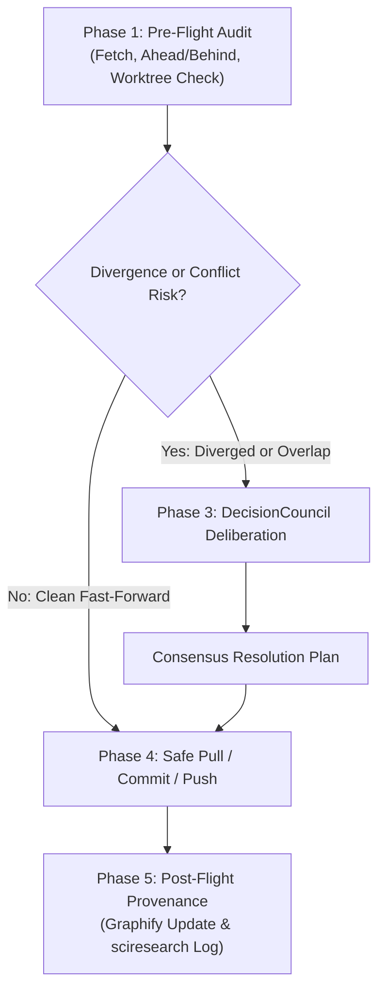

# 🔄 Git-Sync: Safe Remote Synchronization & DecisionCouncil Resolution

## 1. Overview
The **git-sync** skill automates the inspection, diffing, synchronization, conflict prevention, and pushing of project repositories with remote remotes (such as GitHub or GitLab). It enforces rigorous pre-flight audits, prevents accidental overwrites or lost simulation outputs, and triggers the **DecisionCouncil** multi-agent adversarial framework whenever branch histories have diverged or file collisions threaten scientific data integrity.

---

## 2. When to Use
Activate this skill whenever:
- Synchronizing local project state with GitHub/GitLab (`git sync`, `/git-sync`, "sync with github", "pull from remote", "push to origin").
- Auditing differences between local branch (`HEAD`) and remote tracking branch (`origin/master`, `@{u}`).
- Inspecting incoming remote changes before merging or pulling.
- Resolving merge conflicts, diverged branches, or three-way merge disputes.
- Auditing Git credentials, SSH agent keys, and passphrase requirements safely.

---

## 3. Core Protocol & Execution Phases



### Phase 1: Pre-Flight Remote Audit
1. **Fetch Tracking Remote**: Run `git fetch --prune origin` to update remote tracking refs without modifying working files.
2. **Measure Divergence**:
   - Commits ahead: `git rev-list --count @{u}..HEAD`
   - Commits behind: `git rev-list --count HEAD..@{u}`
3. **Inspect Logs & Payloads**:
   - If ahead: `git log @{u}..HEAD --oneline --stat` (unpushed local work).
   - If behind: `git log HEAD..@{u} --oneline --stat` (incoming remote changes).
4. **Inspect Working Tree**:
   - Audit staged, unstaged, and untracked files (`git status --porcelain`).
   - Guard against pulling into an uncommitted, dirty state.

### Phase 2: Conflict & Divergence Detection
The auditor computes the common ancestor:
```bash
MERGE_BASE=$(git merge-base HEAD @{u})
```
It identifies whether any files modified on the remote tracking branch overlap with files modified locally:
```bash
comm -12 <(git diff --name-only $MERGE_BASE..@{u} | sort) <(git diff --name-only $MERGE_BASE..HEAD | sort)
```
- If overlap is detected or the branch has diverged (`ahead > 0` and `behind > 0`), **IMMEDIATELY TRIGGER Phase 3 (DecisionCouncil)**.

### Phase 3: Adversarial Deliberation via DecisionCouncil
When divergence, rebase ambiguity, or merge conflicts arise, the five archetypal voices convene:

| Role | Responsibility in Git-Sync |
| :--- | :--- |
| ⚖️ **The Chairman** | Establishes the core charter: zero scientific data loss, preservation of simulation provenance, and selecting between `git merge --no-ff`, `git rebase --autostash`, or branch isolation. |
| 🔍 **The Fact Checker** | Audits the exact diff chunks. Identifies whether overlapping files are editable code/configs or binary outputs (PDF figures, HDF5, POSCAR, CONTCAR). Verifies commit SHAs and `merge-base`. |
| 🕵️‍♂️ **The Skeptic** | Challenges automatic merging or naive rebasing. Identifies risks of overwriting ongoing DFT calculations, losing uncommitted test results, or dirtying git history. Enforces that no force-push (`-f`) touches published branches. |
| 🌐 **The Scout** | Audits the remote commits. Inspects author names, PR descriptions, and remote branch tags to understand upstream intent before integrating. |
| 📣 **The Advocate** | Formulates the cleanest, fastest integration strategy (e.g. cherry-picking specific commits, rebasing clean commits, or creating an integration merge commit). |

The Chairman delivers the finalized **Resolution Blueprint** before any git merge or rebase command is executed.

### Phase 4: Safeguarded Execution (Merge / Rebase / Push)
1. **Uncommitted Work Isolation**: If uncommitted local changes exist, use `git stash push -m "git-sync-autostash"` or create a temporary WIP commit.
2. **Execute Approved Integration**:
   - Fast-Forward: `git merge --ff-only @{u}`
   - Rebase: `git rebase @{u}` (or with `--autostash`)
   - Explicit Merge: `git merge --no-ff @{u} -m "merge: integrate remote changes from origin/<branch>"`
3. **Commit Stage**: Stage files selectively and commit using semantic commit standards (`feat:`, `fix:`, `refactor:`, `docs:`).

### Phase 5: Authentication & Push Guardrail
1. **SSH Agent Check**:
   - Check if `SSH_AUTH_SOCK` is active and keys are loaded (`ssh-add -l`).
   - Run a non-interactive dry check: `ssh -o BatchMode=yes -o ConnectTimeout=5 -T git@github.com`.
2. **Non-Interactive Execution**:
   - If batch authentication succeeds, execute `git push origin <branch>`.
   - If passphrase is required, **NEVER hang the terminal or ask for private passphrases**. Clearly present the exact user command:
     ```bash
     ssh-add ~/.ssh/id_ed25519 && git push origin master
     ```
3. **Post-Push Verification**:
   - Verify `git rev-parse HEAD` equals `git rev-parse origin/<branch>`.

### Phase 6: Provenance & Knowledge Graph Integration
1. Run `graphify update .` to keep the codebase AST knowledge graph synchronized.
2. In computational projects, invoke `sciresearch` tools (`git_snapshot_state` / `audit_provenance_chain`) to record the commit hash in the scientific provenance chain.

---

## 4. Helper Tool CLI Usage

The skill provides the standalone utility [`scripts/git_sync_tool.py`](file:///home/cr/simulations/scientific-research/skills/git-sync/scripts/git_sync_tool.py):

```bash
# 1. Inspect status, ahead/behind counts, and divergence
python /home/cr/simulations/scientific-research/skills/git-sync/scripts/git_sync_tool.py

# 2. Fetch remote and run complete audit with DecisionCouncil checks
python /home/cr/simulations/scientific-research/skills/git-sync/scripts/git_sync_tool.py --fetch

# 3. Explicitly generate the DecisionCouncil deliberation brief
python /home/cr/simulations/scientific-research/skills/git-sync/scripts/git_sync_tool.py --council

# 4. Attempt safe fast-forward pull (aborts if diverged/conflicted)
python /home/cr/simulations/scientific-research/skills/git-sync/scripts/git_sync_tool.py --fetch --pull

# 5. Attempt safe push (verifies SSH auth first)
python /home/cr/simulations/scientific-research/skills/git-sync/scripts/git_sync_tool.py --push

# 6. Output raw JSON for automated pipelines
python /home/cr/simulations/scientific-research/skills/git-sync/scripts/git_sync_tool.py --json
```
